# Phase 6 Function Flow Screenshots

기준: `http://localhost:3000`, desktop 1440px, full-page capture.

세션: 로컬 개발 DB의 캡쳐용 셀러/관리자 계정과 샘플 주문 1건.

| # | 기능 | 상태 | Screenshot |
|---:|---|---|---|
| 1 | 1688 검색 | 준비 중, 외부 API 호출 없음 | [01-public-search-disabled.png](01-public-search-disabled.png) |
| 2 | 배송조회 | 준비 중, 외부 API 호출 없음 | [02-public-tracking-disabled.png](02-public-tracking-disabled.png) |
| 3 | CBM 계산 | 동작 확인 | [03-calculator-cbm-result.png](03-calculator-cbm-result.png) |
| 4 | 부피중량 계산 | 동작 확인 | [04-calculator-volume-weight-result.png](04-calculator-volume-weight-result.png) |
| 5 | 배송비 계산 | 동작 확인 | [05-calculator-shipping-cost-result.png](05-calculator-shipping-cost-result.png) |
| 6 | 회원가입 후 대시보드 | 동작 확인 | [06-seller-register-dashboard.png](06-seller-register-dashboard.png) |
| 7 | 주문 접수 폼 입력 | 동작 확인 | [07-seller-order-form-filled.png](07-seller-order-form-filled.png) |
| 8 | 주문 접수 후 목록 | 동작 확인 | [08-seller-order-list-created.png](08-seller-order-list-created.png) |
| 9 | 셀러 주문 상세: 접수 | 동작 확인 | [09-seller-order-detail-requested.png](09-seller-order-detail-requested.png) |
| 10 | 창고 주소 복사 | 동작 확인 | [10-warehouse-copy-button.png](10-warehouse-copy-button.png) |
| 11 | 운영자 주문 목록: 접수 | 동작 확인 | [11-admin-order-list-requested.png](11-admin-order-list-requested.png) |
| 12 | 운영자 입고 기록 폼 | 동작 확인 | [12-admin-inbound-form.png](12-admin-inbound-form.png) |
| 13 | 입고 후 운영자 목록 | 동작 확인 | [13-admin-order-list-received.png](13-admin-order-list-received.png) |
| 14 | 운영자 견적 입력 폼 | 동작 확인 | [14-admin-quote-form.png](14-admin-quote-form.png) |
| 15 | 견적 후 운영자 목록 | 동작 확인 | [15-admin-order-list-quoted.png](15-admin-order-list-quoted.png) |
| 16 | 셀러 주문 상세: 견적 반영 | 동작 확인 | [16-seller-order-detail-quoted.png](16-seller-order-detail-quoted.png) |

## 01 1688 검색

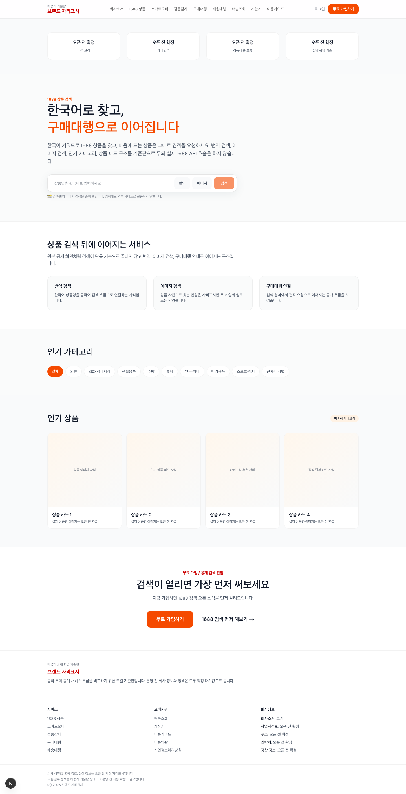

## 02 배송조회

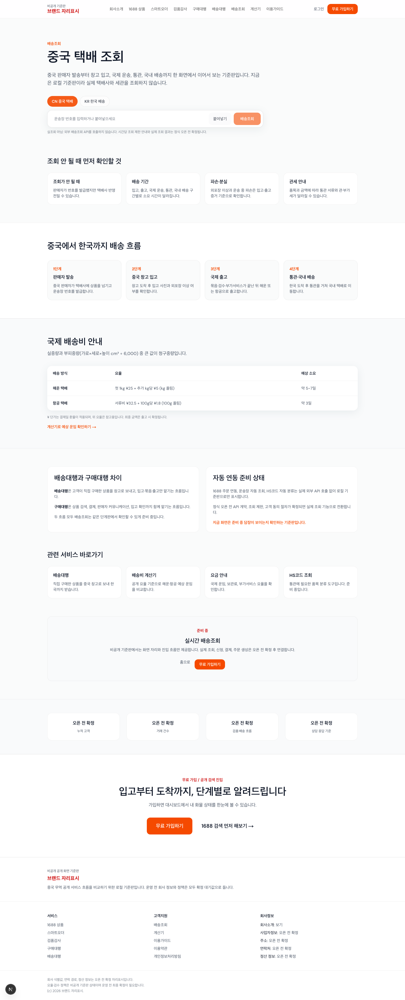

## 03 CBM 계산

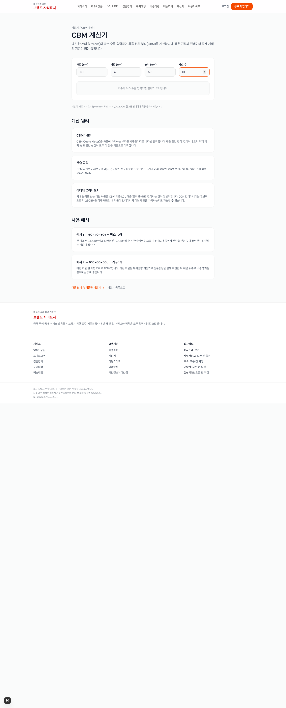

## 04 부피중량 계산

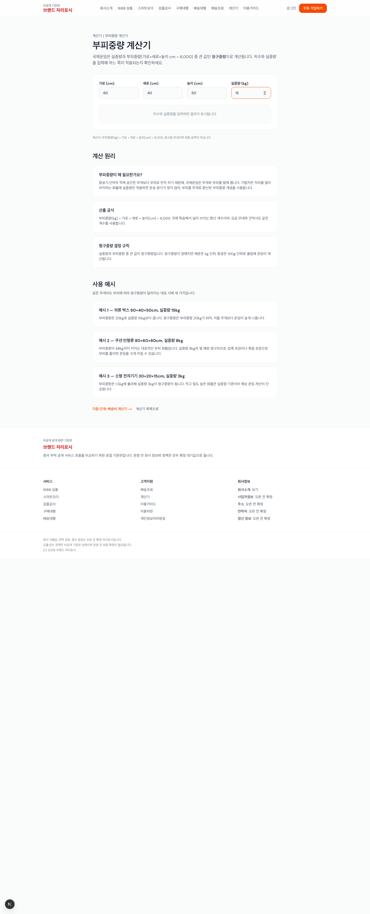

## 05 배송비 계산

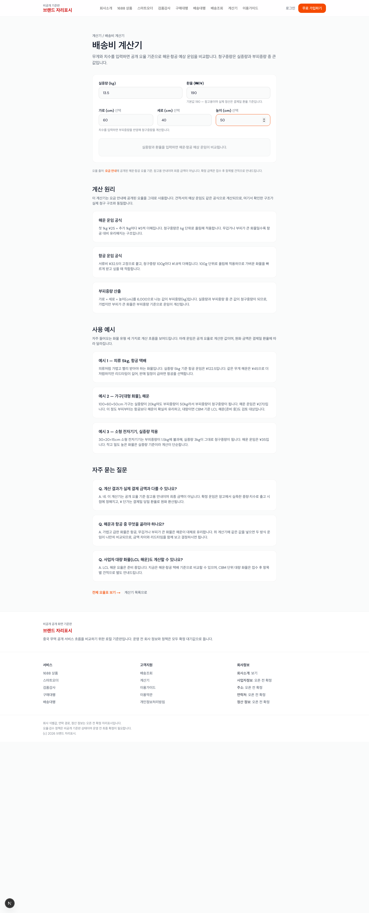

## 06 회원가입 후 대시보드

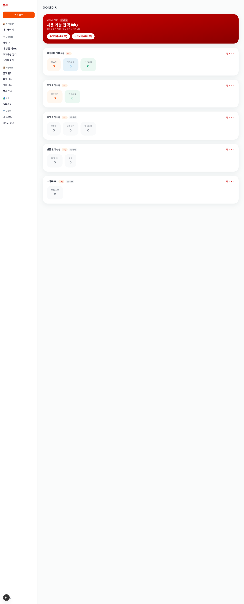

## 07 주문 접수 폼 입력

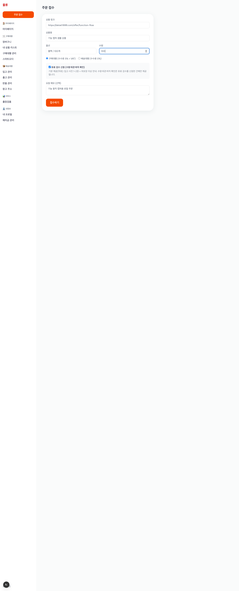

## 08 주문 접수 후 목록

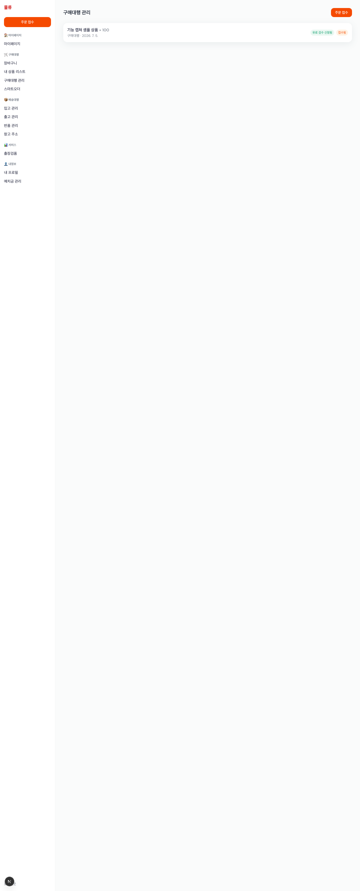

## 09 셀러 주문 상세: 접수

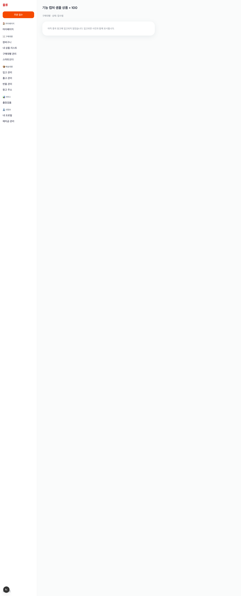

## 10 창고 주소 복사

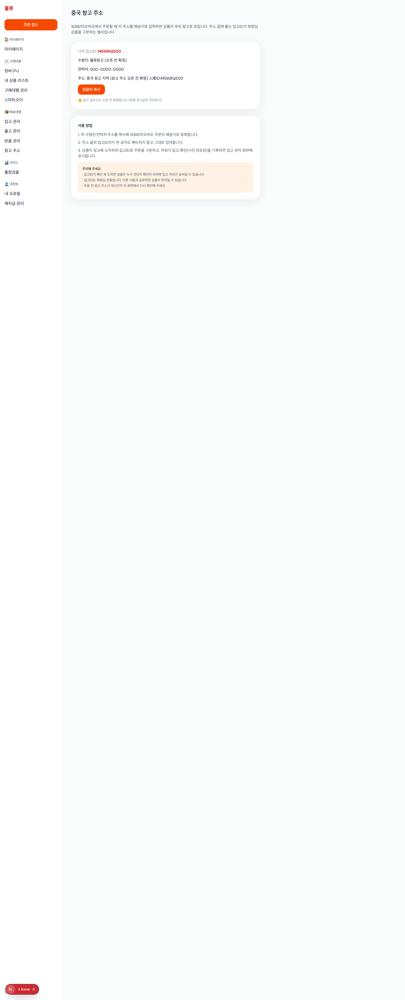

## 11 운영자 주문 목록: 접수

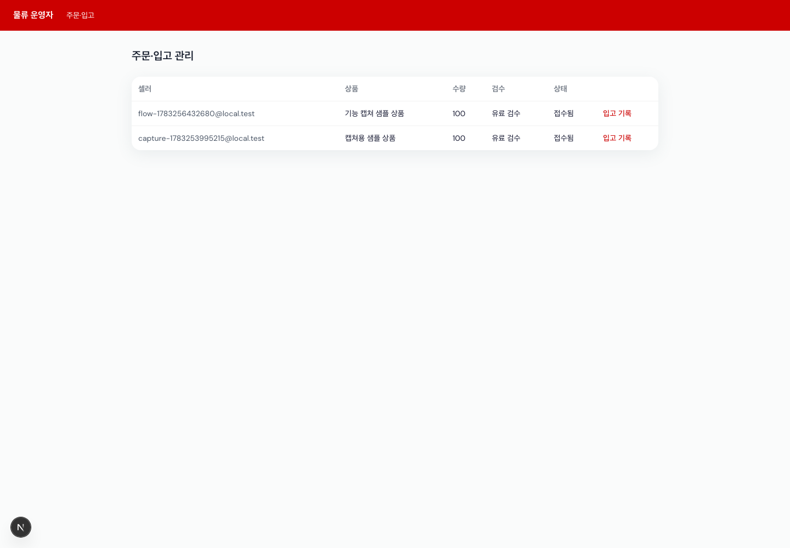

## 12 운영자 입고 기록 폼

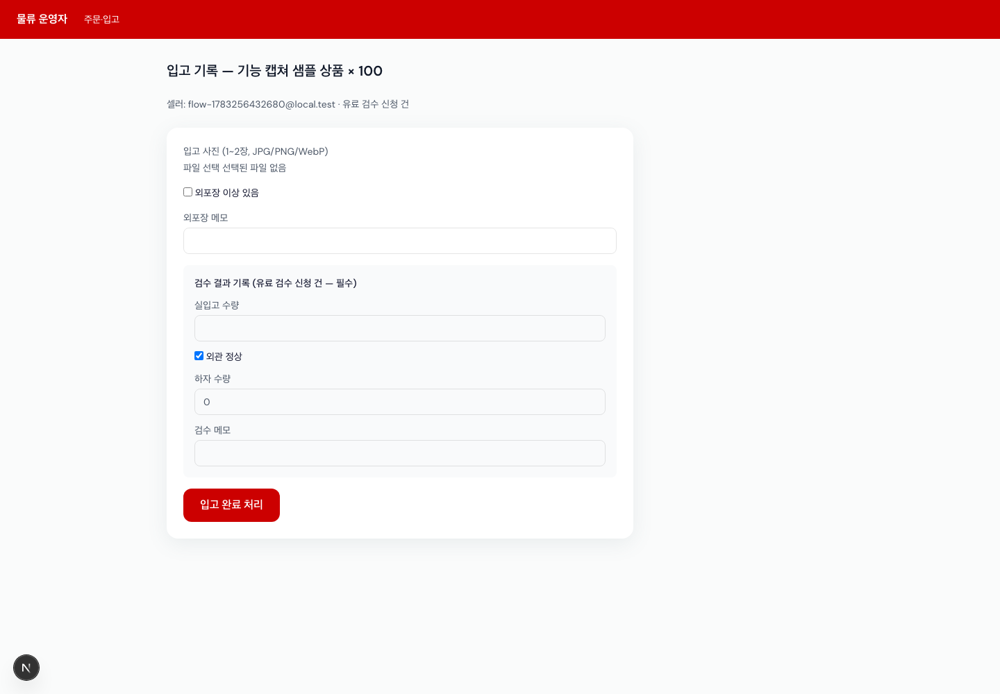

## 13 입고 후 운영자 목록

## 14 운영자 견적 입력 폼

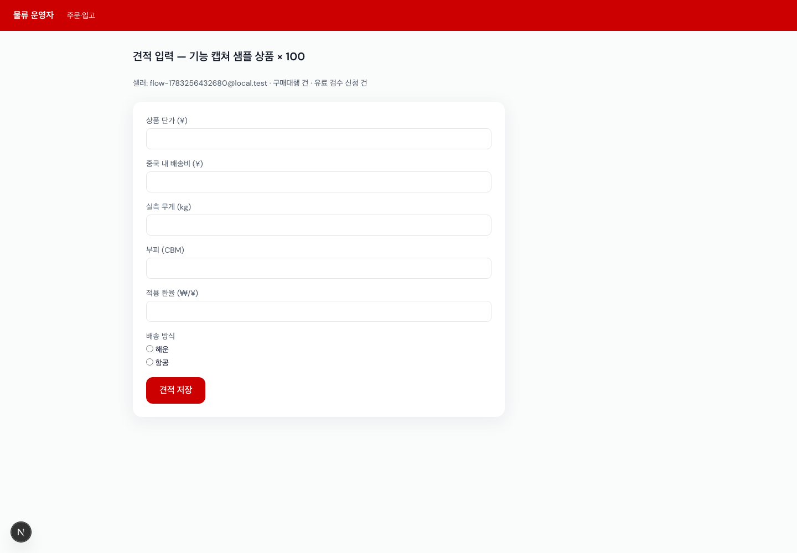

## 15 견적 후 운영자 목록

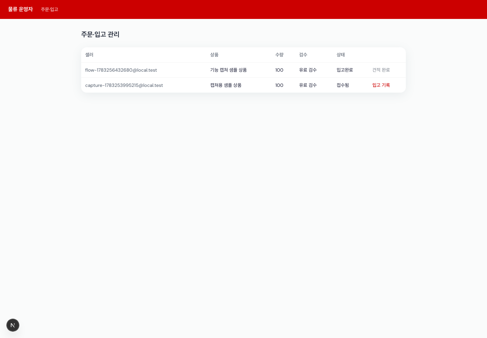

## 16 셀러 주문 상세: 견적 반영

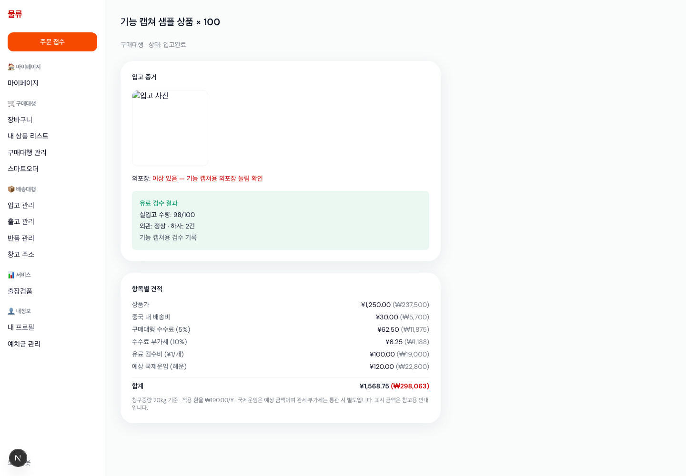
